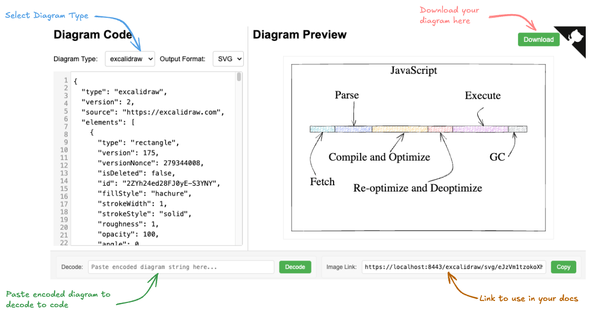

# DocCode - The Kroki Frontend

A complete setup for running DocCode (doc-code), an advanced web frontend for Kroki diagram servers with AI assistance and comprehensive diagram editing capabilities.




<blockquote style="background:#f9f9f9; border-left: 6px solid #ccc; padding: 1em; font-size: 0.95em;">
  <strong>Note:</strong><br>
  While the initial framework and specifications were manually crafted, over <strong>90%</strong> of the code in this repository was generated using AI tools. As such, the code quality and structure may not fully reflect best practices and have not undergone extensive manual review.<br><br>
  That said, I have been actively <em>dogfooding</em> the tool, and it is functional and working as intended in real-world usage.
</blockquote>


<p align="center">
  
</p>


## Quick Start

```bash
# Clone the repository
git clone https://github.com/vppillai/kroki-server.git
cd kroki-server

# Start DocCode with Kroki backend
./setup-kroki-server.sh start

# Access DocCode (default port)
# Default: https://localhost:8443/
# Port configurable in .env file

# Test the configured endpoint
./setup-kroki-server.sh health
```

## Overview

DocCode is a feature-rich web frontend for [Kroki](https://kroki.io/) diagram rendering servers. This project provides a complete solution including:

- **DocCode Frontend**: Advanced web interface with real-time diagram editing and preview
- **AI-Powered Assistance**: Integrated AI assistant for diagram generation and code suggestions
- **Kroki Backend**: Docker Compose setup for running the Kroki server and its dependencies
- **HTTPS Support**: Secure access via self-signed certificates
- **Flexible Configuration**: Configurable ports and settings via environment variables
- **Professional Features**: File operations, auto-save, syntax highlighting, and comprehensive settings

## Configuration

### Port Configuration

The server ports can be configured through the `.env` file (single values only):

```bash
HTTP_PORT=8000                  # Kroki core server port
HTTPS_PORT=8443                 # Nginx HTTPS proxy port
DEMOSITE_CONTAINER_PORT=8006    # DocCode frontend internal port
HOSTNAME=localhost              # Hostname for SSL certificate and CORS
```

### Changing Ports:
1. Edit the `.env` file with your desired port numbers:
   - `HTTP_PORT=8000` and `HTTPS_PORT=8443`
2. Restart the services: `./setup-kroki-server.sh restart`
3. Access the site at: `https://{hostname}:{HTTPS_PORT}/`

**Example**:
- `https://localhost:8443/`

**Note**: After changing ports, restart the services with `./setup-kroki-server.sh restart` to apply the new configuration.

### Configuration Management

The server uses environment variables from the `.env` file to configure ports and hostnames:

#### How It Works
- **Environment Variables**: Port configuration is read directly from the `.env` file
- **Docker Compose**: Uses `${HTTP_PORT:-8000}` and `${HTTPS_PORT:-8443}` syntax for defaults
- **Automatic Loading**: The `.env` file is automatically loaded by Docker Compose

#### Example Configuration
```yaml
# docker-compose.yml (simplified port mapping)
services:
  nginx:
    ports:
      - "${HTTPS_PORT:-8443}:8443"
  core:
    ports:
      - "${HTTP_PORT:-8000}:8000"
```

### Security and CORS

The server includes CORS (Cross-Origin Resource Sharing) configuration:

#### Multi-Origin Support
- **Dynamic Whitelist**: Automatically generates CORS whitelist from all hostname/port combinations
- **Secure by Default**: Only configured hostnames and ports are allowed
- **Development Friendly**: Includes common localhost variants for development
- **Production Ready**: Strict origin validation for production deployments

#### CORS Configuration
All combinations of configured hostnames and HTTPS ports are automatically whitelisted:
- `https://localhost:8443`, `https://localhost:9443`, `https://localhost:10443`
- `https://127.0.0.1:8443`, `https://127.0.0.1:9443`, `https://127.0.0.1:10443`
- `https://kroki.local:8443`, `https://kroki.local:9443`, `https://kroki.local:10443`

### Health Monitoring System

Comprehensive health monitoring for all configured endpoints:

#### Health Check Features
- **Multi-Endpoint Testing**: Tests all hostname/port combinations automatically
- **Detailed Reporting**: Shows success/failure status for each endpoint
- **Summary Statistics**: Provides overview of healthy vs failed endpoints
- **Optional Execution**: Health checks are available on-demand, not run automatically
- **Fast Execution**: Configurable timeouts for quick assessment

#### Usage
```bash
# Run comprehensive health checks
./setup-kroki-server.sh health

# Example output:
# Testing https://localhost:8443... ✓ OK
# Testing https://localhost:9443... ✓ OK
# Testing https://localhost:10443... ✓ OK
# Testing https://127.0.0.1:8443... ✓ OK
# Testing https://127.0.0.1:9443... ✓ OK
# Testing https://127.0.0.1:10443... ✓ OK
# Testing https://kroki.local:8443... ✗ FAILED
# Testing https://kroki.local:9443... ✗ FAILED
# Testing https://kroki.local:10443... ✗ FAILED
#
# Health Check Summary:
#   Total endpoints tested: 9
#   Successful: 6
#   Failed: 3
#   Status: Some endpoints failed ✗
```

### AI Assistant Configuration

DocCode includes an integrated AI assistant for diagram creation and modification:

#### AI Configuration in .env

```bash
# AI Assistant Settings
AI_ENABLED=true                                    # Enable/disable AI features
AI_ENDPOINT="https://api.openai.com/v1/chat/completions"  # OpenAI API endpoint
AI_MODEL=gpt-4.1                                   # AI model to use
AI_TIMEOUT=30                                      # Request timeout in seconds
AI_API_KEY=                                        # Your OpenAI API key (required for AI features)

# AI Prompt Templates (advanced configuration)
AI_SYSTEM_PROMPT="..."                             # System prompt for diagram generation
AI_USER_PROMPT="..."                               # User request template
AI_RETRY_PROMPT="..."                              # Error recovery template
```

#### AI Features

- **Diagram Generation**: Create diagrams from natural language descriptions
- **Code Assistance**: Get help with diagram syntax and structure  
- **Error Recovery**: Automatic syntax error detection and correction
- **Multi-Format Support**: Works with all supported Kroki diagram types
- **Context Awareness**: Understands current diagram type and existing code

#### Setting Up AI Features

1. **Get OpenAI API Key**: Sign up at [OpenAI](https://platform.openai.com/) and generate an API key
2. **Configure .env**: Add your API key to `AI_API_KEY=your_key_here`
3. **Restart Services**: Run `./setup-kroki-server.sh restart` to apply changes
4. **Test AI Assistant**: Use the AI chat interface in DocCode

#### AI Assistant Usage

- **Natural Language**: "Create a sequence diagram showing user login process"
- **Code Modification**: "Add error handling to this flowchart"
- **Syntax Help**: "Fix the syntax errors in my PlantUML code"
- **Format Conversion**: "Convert this flowchart to Mermaid format"

**Note**: AI features require a valid OpenAI API key. Set `AI_ENABLED=false` to disable AI features if not needed.

## DocCode Frontend

DocCode is accessible at `https://localhost:{HTTPS_PORT}/` (default: https://localhost:8443/), and provides an interactive interface for creating and previewing diagrams.

### DocCode Features

DocCode provides a comprehensive diagram editing experience with professional-grade features:

#### Core Functionality
- Supports all diagram types provided by Kroki
- Real-time diagram preview with automatic updates
- Format conversion (SVG, PNG, PDF, etc.)
- Comprehensive diagram code examples for all supported formats
- Download rendered diagrams in multiple formats
- Syntax highlighting and line numbers in the editor
- Responsive design optimized for all screen sizes

#### Advanced Editing
- Interactive zoom and pan for diagram images
  - Mouse wheel zoom with precise cursor positioning
  - Click and drag to pan around large diagrams
  - Touch support for mobile devices (pinch to zoom, drag to pan)
  - Keyboard shortcuts (Ctrl/Cmd + +/- for zoom, Ctrl/Cmd + 0 to reset)
  - Zoom controls with visual feedback
  - Zoom state preservation - maintains zoom level and position when updating diagram code
  - Double-click to reset zoom to fit
  - Help modal with detailed usage instructions

#### Professional File Operations
- Create new diagrams with automatic type detection
- Open local diagram files directly from your file system
- Save diagrams to local files with proper extensions
- Save As functionality for creating new files
- Keyboard shortcuts for all file operations (Ctrl/Cmd + N/O/S)
- Automatic file type detection from content and extensions
- File modification tracking with unsaved changes warnings
- Support for multiple diagram file formats (.puml, .mmd, .dot, .d2, etc.)
- Modern File System Access API with fallback for older browsers
- Auto-reload file monitoring with configurable delay (500-5000ms, default 1 second)
- Real-time file change detection and automatic diagram updates
- Smart file monitoring that activates only when needed

### URL Parameter Functionality

DocCode supports URL parameters for sharing and bookmarking diagrams:

- `diag` - Sets the diagram type (e.g., plantuml, mermaid, graphviz)
- `fmt`  - Sets the output format (e.g., svg, png, pdf)
- `im`   - Contains the encoded diagram content

These URL parameters work with smart initialization:

- Smart initialization order ensures dropdowns are ready before URL processing
- When changing diagram types in the UI, the URL is automatically updated
- URL loading: Pages loaded with format parameters properly show default examples
- When you edit diagram code, the URL updates in real-time for sharing
- If you specify an unsupported format for a diagram type, it automatically defaults to a supported one
- When the code editor is emptied, the im parameter is removed from the URL
- Formats are preserved when switching diagram types if the format is supported

Example URL:

```
https://localhost:8443/?fmt=svg&diag=svgbob&im=eJyFjzEOgzAMRXdO4Y0gYbMjhYsAslQlQ4dyAh--P0aAaKv0D06i__ztEH1KuA9EXc_S4KWqKIcTLqxzf0a_WjRinoqZX4-cUk7PbSvMjuopdAzjOJCpudPeEoVb5DA0q4hoKbQ2X_uhSYLDP7xDyzXZjwqKPMz0fYwsRquxLiuxYHH7y-K7-4fV3rbfQbI%3D
```

### Supported Diagram Types
- PlantUML
- Mermaid
- GraphViz
- BPMN
- BlockDiag
- C4 (with PlantUML)
- DBM
- D2
- Excalidraw
- ERD
- And many more...

### Supported Output Formats

Format support varies by diagram type, but generally includes:

- `SVG` - Scalable Vector Graphics
- `PNG` - Portable Network Graphics
- `PDF` - Portable Document Format
- `JPEG` - For selected diagram types
- `TXT` - Text output (for selected diagram types)
- `Base64` - Encoded output (for selected diagram types)

### Interactive Tools

- Code Editor: Create and edit diagram code with line numbering
- Format Selector: Choose output format based on diagram type
- Live Preview: See your diagram update as you type (with debouncing)
- Download Button: Save generated diagrams in various formats
- Image Link Copying: Easily share direct links to generated images
- Decoder Tool: Convert encoded diagrams back to source code
- Zoom and Pan Controls: Interactive viewing for large diagrams
  - Mouse Controls: Wheel to zoom, click-drag to pan, double-click to reset
  - Touch Controls: Pinch to zoom, single-finger drag to pan
  - Keyboard Shortcuts: 
    - `Ctrl/Cmd + +`: Zoom in
    - `Ctrl/Cmd + -`: Zoom out  
    - `Ctrl/Cmd + 0`: Reset zoom
  - Smart State Management: Zoom level and position are preserved when updating diagram code
  - Visual Feedback: Real-time zoom percentage display
  - Help System: Built-in help modal with usage instructions

## File Operations

DocCode includes comprehensive file operations that make it work like a standalone diagram editor:

### Creating and Managing Files

- **New File**: Click the "📄 New" button or use `Ctrl/Cmd + N` to create a new diagram
- **Open File**: Click the "📁 Open" button or use `Ctrl/Cmd + O` to open existing diagram files
- **Save File**: Click the "💾 Save" button or use `Ctrl/Cmd + S` to save your work
- **Save As**: Click the "📄 Save As" button or use `Ctrl/Cmd + Shift + S` to save with a new name

### Supported File Formats

The editor automatically detects diagram types from file content and extensions:

- **PlantUML**: `.puml`, `.plantuml`, `.uml`, `.txt`
- **Mermaid**: `.mmd`, `.mermaid`
- **GraphViz**: `.dot`, `.gv`
- **D2**: `.d2`
- **DBML**: `.dbml`
- **BPMN**: `.bpmn`
- **ERD**: `.erd`
- **TikZ**: `.tikz`
- **And more**: `.md`, `.py`, `.js`, `.json`, `.xml`, `.yaml`, `.yml`, `.svg`

### File Status Indicators

- **File Name**: Displayed in the editor header
- **Modified Indicator**: An asterisk (*) appears next to the file name when there are unsaved changes
- **Save Button State**: Automatically enabled/disabled based on file status
- **Unsaved Changes Warning**: Browser warns before leaving with unsaved changes

### Browser Compatibility

- **Modern Browsers** (Chrome 86+, Edge 86+): Full File System Access API support for direct file system integration
- **Other Browsers** (Firefox, Safari): Automatic fallback to download/upload methods

### Configuration

DocCode includes comprehensive configuration options accessible through Settings:

#### Editor Settings
- **Auto-reload Monitoring Delay**: Configurable file monitoring interval (500-5000ms, default 1000ms)
- **Auto-save**: Automatic saving of changes with configurable delay
- **Debounce Delay**: Diagram update delay for performance optimization
- **Code Editor**: Line numbers, word wrap, tab size, and other editor preferences
- **Theme Settings**: Dark/light mode with system preference detection

#### File Operations
- **Auto-save Toggle**: Enable/disable automatic file saving
- **Auto-reload Toggle**: Enable/disable automatic file monitoring and reloading
- **File Type Detection**: Automatic diagram type detection from file content

#### UI Preferences
- **Layout Options**: Responsive design settings and layout preferences
- **Zoom Settings**: Default zoom behavior and interaction preferences
- **Accessibility**: High contrast mode and keyboard navigation options

All configuration changes are applied in real-time and persist across browser sessions.

## AI Assistant Features

DocCode includes an integrated AI assistant that can help you create, modify, and understand diagrams. The AI assistant supports multiple models and can be configured to use either the server's backend or your own API credentials.

### AI Model Support

The AI assistant supports a wide range of modern language models:

**GPT Models:**
- `gpt-4.1` - Latest GPT-4.1 model
- `gpt-4.1-mini` - Optimized GPT-4.1 for faster responses
- `gpt-4.1-nano` - Lightweight GPT-4.1 variant
- `gpt-4.5-preview` - Preview of GPT-4.5 capabilities
- `gpt-4o` - GPT-4 Omni model
- `gpt-4o-mini` - Compact GPT-4 Omni variant

**O-Series Models:**
- `o4-mini` - OpenAI's o4-mini reasoning model
- `o3` - OpenAI's o3 reasoning model
- `o3-mini` - Compact o3 reasoning model

**Custom Models:**
- `custom` - Use your own model name with custom API configuration

### AI Assistant Interface

The AI assistant is accessible through:

- **Chat Window**: Click the "🤖 AI Assistant" button to open the interactive chat interface
- **Backend Indicator**: A badge showing the current AI backend configuration:
  - `Server Backend` - Using the server's default AI configuration
  - `ModelName (Custom)` - Using your custom API settings with the specified model

### AI Configuration Options

#### Using Server Backend (Default)

By default, the AI assistant uses the server's configured AI backend. No additional setup is required from the user.

#### Using Custom API Configuration

You can configure your own AI API credentials through the settings:

1. **Access Settings**: Click the gear icon (⚙️) in the AI assistant window
2. **Configure API**: Enter your custom settings:
   - **API Key**: Your OpenAI or compatible API key
   - **Base URL**: Custom API endpoint (optional, defaults to OpenAI)
   - **Model**: Select from supported models or choose "custom" to specify your own
   - **Custom Model Name**: When "custom" is selected, specify your model name

3. **Save Settings**: Settings are automatically saved and persisted locally

### AI Capabilities

The AI assistant can help you with:

#### Diagram Creation and Modification
- **Generate Diagrams**: Create new diagrams from natural language descriptions
- **Modify Existing**: Update and enhance existing diagram code
- **Format Conversion**: Help convert between different diagram formats
- **Best Practices**: Suggest improvements and follow diagram-specific conventions

#### Diagram Understanding
- **Code Explanation**: Explain what existing diagram code does
- **Troubleshooting**: Help debug diagram rendering issues
- **Optimization**: Suggest ways to improve diagram clarity and structure

#### Interactive Features
- **Context Awareness**: The AI can see your current diagram code and provide relevant suggestions
- **Real-time Assistance**: Get help while actively editing diagrams
- **Multi-turn Conversations**: Build on previous interactions for complex diagram development

### AI Usage Examples

#### Creating a New Diagram
```
User: "Create a PlantUML sequence diagram showing a user login flow"
AI: [Generates appropriate PlantUML code for a login sequence diagram]
```

#### Modifying Existing Diagrams
```
User: "Add error handling to this sequence diagram"
AI: [Analyzes current diagram and adds error handling flows]
```

#### Understanding Complex Diagrams
```
User: "Explain what this GraphViz diagram represents"
AI: [Provides detailed explanation of the diagram structure and relationships]
```

### Privacy and Security

- **Local Storage**: Custom API settings are stored locally in your browser
- **No Server Storage**: When using custom API configuration, your credentials are not sent to the server
- **Secure Communication**: All API communications use HTTPS encryption
- **Optional Feature**: The AI assistant is completely optional and can be ignored if not needed

### Troubleshooting AI Features

#### Common Issues

1. **"Server Backend" Not Working**
   - Ensure the server is configured with AI credentials (see `.env` file)
   - Check server logs for AI service availability

2. **Custom API Configuration Issues**
   - Verify your API key is valid and has sufficient credits
   - Check that the base URL is correct for your API provider
   - Ensure the selected model is available with your API key

3. **Model Not Responding**
   - Try switching to a different model
   - Check your internet connection
   - Verify API rate limits haven't been exceeded

#### Settings Management

- **Reset Settings**: Clear your browser's local storage to reset AI configuration
- **Export/Import**: Settings can be manually exported from browser developer tools if needed
- **Multiple Configurations**: Each browser/device maintains its own AI settings

### Integration with Diagram Workflow

The AI assistant seamlessly integrates with the diagram creation workflow:

- **Context Preservation**: AI understands your current diagram type and content
- **Format Awareness**: Suggestions are tailored to your selected diagram format
- **Real-time Updates**: Changes suggested by AI can be immediately applied and previewed
- **File Operations**: AI-generated content works with all file operations (save, load, etc.)

## Architecture

The system consists of several containerized services:

```
┌─────────────┐     ┌─────────────┐     ┌─────────────┐
│  Nginx      │     │  Core       │     │  Mermaid    │
│  Proxy      │────▶│  Kroki      │────▶│  Renderer   │
│  Container  │     │  Container  │     │  Container  │
└─────────────┘     └─────────────┘     └─────────────┘
       │                   │                   │
       │                   │                   │
       │                   ▼                   │
       │            ┌─────────────┐            │
       │            │  BPMN       │            │
       │            │  Renderer   │            │
       │            │  Container  │            │
       │            └─────────────┘            │
       │                   │                   │
       ▼                   ▼                   ▼
┌─────────────┐     ┌─────────────┐     ┌─────────────┐
│   DocCode   │     │ Excalidraw  │     │ DiagramsNet │
│  Container  │     │  Renderer   │     │  Renderer   │
└─────────────┘     └─────────────┘     └─────────────┘
```

- **Nginx**: Routes requests and serves HTTPS
- **Core Kroki**: Main service that coordinates diagram rendering
- **Renderers**: Specialized containers for different diagram types
- **DocCode**: Advanced web frontend for creating and previewing diagrams

## Deployment

### Requirements

- Docker
- Docker Compose
- Bash shell

### Setup Options

The [`setup-kroki-server.sh`](setup-kroki-server.sh) script provides several commands:

```bash
# Start the server
./setup-kroki-server.sh start

# Stop the server
./setup-kroki-server.sh stop

# Restart the server
./setup-kroki-server.sh restart

# Clean up all containers and data
./setup-kroki-server.sh clean

# View the container logs
./setup-kroki-server.sh logs

# Check container status
./setup-kroki-server.sh status

# Run health checks on all configured endpoints
./setup-kroki-server.sh health

# Get help information
./setup-kroki-server.sh help
```

### Custom Hostname

By default, the server uses `localhost`. You can specify a custom hostname:

```bash
./setup-kroki-server.sh start --hostname your-domain.com
```

### Custom SSL Certificates

You can provide your own SSL certificates:

```bash
./setup-kroki-server.sh start --cert path/to/cert.crt --key path/to/key.key
```

### Health Monitoring

The health monitoring system provides comprehensive testing of all configured server endpoints:

#### Running Health Checks

```bash
# Test all configured hostname/port combinations
./setup-kroki-server.sh health
```

#### Health Check Output

The health command tests every combination of hostnames and HTTPS ports defined in your `.env` file:

```
Testing https://localhost:8443... ✓ OK
Testing https://localhost:9443... ✓ OK  
Testing https://localhost:10443... ✓ OK
Testing https://127.0.0.1:8443... ✓ OK
Testing https://127.0.0.1:9443... ✓ OK
Testing https://127.0.0.1:10443... ✓ OK
Testing https://kroki.local:8443... ✗ FAILED
Testing https://kroki.local:9443... ✗ FAILED
Testing https://kroki.local:10443... ✗ FAILED

Health Check Summary:
  Total endpoints tested: 9
  Successful: 6
  Failed: 3
  Status: Some endpoints failed ✗
```

#### When to Use Health Checks

- **After Configuration Changes**: Verify new ports and hostnames are working
- **Deployment Verification**: Confirm all endpoints are accessible after deployment
- **Network Troubleshooting**: Identify which hostname/port combinations have issues
- **Load Balancer Testing**: Verify all configured endpoints for load balancing setups
- **Security Auditing**: Ensure only intended endpoints are accessible

#### Health Check Features

- **Fast Execution**: Concurrent testing with configurable timeouts (5s connect, 10s total)
- **Detailed Reporting**: Individual endpoint status plus summary statistics
- **Exit Codes**: Returns 0 for all healthy, 1 for any failures (useful in scripts)
- **SSL Support**: Tests HTTPS endpoints with certificate validation bypass for self-signed certs
- **Network Resilience**: Handles network timeouts and connection failures gracefully

## How It Works

1. The user writes diagram code in the editor
2. The code is compressed and encoded using deflate and base64
3. A request is sent to the Kroki server
4. The appropriate renderer container processes the diagram
5. The result is returned to the browser and displayed

## API Usage

The Kroki server supports both GET and POST requests for diagram generation, making it suitable for both web applications and programmatic access.

### GET Requests (Standard Kroki API)

GET requests follow the standard Kroki URL format with encoded diagram content:

```bash
# Basic format
GET /diagram-type/output-format/encoded-content

# Example: PlantUML diagram as SVG
GET /plantuml/svg/SyfFKj2rKt3CoKnELR1Io4ZDoSa70000
```

### POST Requests (Raw Content)

POST requests allow sending raw diagram code directly without encoding, making them ideal for:
- Large diagrams (up to 10MB supported)
- Programmatic integration
- Development and testing
- Content that doesn't encode well in URLs

#### POST Request Format

```bash
POST /diagram-type/output-format
Content-Type: text/plain

[Raw diagram code here]
```

#### Examples

**PlantUML Sequence Diagram:**
```bash
curl -X POST "https://localhost:8443/plantuml/svg" \
  -H "Content-Type: text/plain" \
  -d "@startuml
Alice -> Bob: Hello
Bob -> Alice: Hi!
@enduml" \
  --insecure
```

**Mermaid Flowchart:**
```bash
curl -X POST "https://localhost:8443/mermaid/png" \
  -H "Content-Type: text/plain" \
  -d "graph TD
A[Start] --> B[Process]
B --> C[End]" \
  --insecure
```

**GraphViz Diagram:**
```bash
curl -X POST "https://localhost:8443/graphviz/pdf" \
  -H "Content-Type: text/plain" \
  -d "digraph G {
  A -> B -> C;
  A -> C;
}" \
  --insecure
```

#### POST from File

```bash
# Send diagram code from a file
curl -X POST "https://localhost:8443/plantuml/svg" \
  -H "Content-Type: text/plain" \
  -d @my-diagram.puml \
  --insecure

# Save result to file
curl -X POST "https://localhost:8443/mermaid/png" \
  -H "Content-Type: text/plain" \
  -d @flowchart.mmd \
  --insecure \
  -o result.png
```

### Supported Diagram Types

All standard Kroki diagram types are supported for both GET and POST requests:

- `plantuml` - PlantUML diagrams
- `mermaid` - Mermaid diagrams  
- `graphviz` - GraphViz/DOT diagrams
- `bpmn` - BPMN diagrams
- `bytefield` - Bytefield diagrams
- `c4plantuml` - C4 diagrams with PlantUML
- `d2` - D2 diagrams
- `dbml` - Database markup language
- `diagramsnet` - Draw.io diagrams
- `ditaa` - ASCII art diagrams
- `erd` - Entity relationship diagrams
- `excalidraw` - Hand-drawn style diagrams
- `nomnoml` - UML diagrams
- `pikchr` - Pikchr diagrams
- `svgbob` - ASCII to SVG conversion
- `tikz` - TikZ diagrams
- `vega` - Vega visualizations
- `vegalite` - Vega-Lite visualizations
- `wavedrom` - Digital timing diagrams
- `wireviz` - Cable and wiring diagrams

### Supported Output Formats

Format availability depends on the diagram type:

- `svg` - Scalable Vector Graphics (most widely supported)
- `png` - Portable Network Graphics
- `pdf` - Portable Document Format
- `jpeg` - JPEG images (selected types)
- `txt` - Text output (selected types)
- `base64` - Base64 encoded output

### Request Size Limits

- **POST requests**: Up to 10MB of diagram content supported
- **GET requests**: Limited by URL length (typically ~2KB)

### Error Handling

The API returns appropriate HTTP status codes:

- `200 OK` - Diagram generated successfully
- `400 Bad Request` - Invalid diagram syntax or unsupported format
- `404 Not Found` - Invalid diagram type or endpoint
- `413 Payload Too Large` - Request exceeds 10MB limit
- `500 Internal Server Error` - Server processing error

Error responses include descriptive messages when possible.

### Content Type Headers

- **Request**: `Content-Type: text/plain` for raw diagram code
- **Response**: Varies by output format (e.g., `image/svg+xml`, `image/png`, `application/pdf`)

### HTTPS and Self-Signed Certificates

When using the default self-signed certificates, add `--insecure` to curl commands or configure your HTTP client to accept self-signed certificates.

## Development

### DocCode Frontend Structure

DocCode is built with a modular architecture for maintainability and extensibility:

- [`demoSite/index.html`](demoSite/index.html) - Main HTML structure with responsive layout
- [`demoSite/js/main.js`](demoSite/js/main.js) - Core application initialization and coordination
- [`demoSite/js/config.js`](demoSite/js/config.js) - Configuration definitions and defaults
- [`demoSite/js/config-ui.js`](demoSite/js/config-ui.js) - Settings interface and user preferences
- [`demoSite/js/modules/`](demoSite/js/modules/) - Modular JavaScript components:
  - `state.js` - Application state management
  - `constants.js` - Application constants and defaults
  - `configuration.js` - Configuration system integration
  - `fileOperations.js` - File handling and monitoring with auto-reload
  - `urlHandler.js` - URL parameter processing
  - `diagramOperations.js` - Diagram rendering and format management
  - `utils.js` - Utility functions and helpers
  - `theme.js` - Theme management and dark/light mode
  - `zoomPan.js` - Interactive image viewing controls
  - `fullscreen.js` - Fullscreen mode functionality
  - `search.js` - Code search and navigation
- [`demoSite/css/`](demoSite/css/) - Modular CSS with theme support
- [`demoSite/examples/`](demoSite/examples/) - Example diagram code for each format

### Key Implementation Features

- **Modular Architecture**: Clean separation of concerns with ES6 modules
- **State Management**: Centralized application state with reactive updates  
- **Configuration System**: Comprehensive settings with real-time application
- **File Monitoring**: Auto-reload functionality with configurable delays (500-5000ms)
- **URL Processing**: Initialization order for proper parameter handling
- **Error Handling**: Robust error management with user-friendly feedback
- **Performance Optimization**: Debounced updates and efficient rendering

### Nginx Configuration

The Nginx proxy handles routing and SSL:

- Routes diagram requests to the core Kroki server
- Serves the DocCode frontend static files
- Manages SSL certificates

### Docker Compose Configuration

The [`docker-compose.yml`](docker-compose.yml) file defines the container relationships and networking.

## Debugging

### Common Issues

1. **Certificate Errors**: The default setup uses self-signed certificates, which will trigger browser warnings. Add an exception or provide trusted certificates.

2. **Port Conflicts**: If the default HTTPS port (8443) is already in use, you can change it in the `.env` file:
   ```bash
   # Edit .env file
   HTTPS_PORT=9443  # or any other available port
   ```

3. **Container Issues**: Check logs for more details if any service fails to start.

### Useful Debug Commands

```bash
# List status of docker compose images
docker-compose ps

# Get the demosite logs
docker-compose logs demosite

# Get logs for the core Kroki service
docker-compose logs core

# List networks
docker network list

# Inspect the Kroki network
docker network inspect kroki-server_kroki_network
```

## Quick Reference

### Auto-reload Configuration
1. Open Settings (⚙️ gear icon)
2. Navigate to Advanced → Editor Settings  
3. Adjust "Auto-reload Monitoring Delay" slider (500-5000ms)
4. Enable auto-reload toggle in the toolbar
5. Changes apply immediately to active file monitoring

### URL Parameter Usage
- **Format-only URLs**: `https://localhost:{HTTPS_PORT}/?format=plantuml` (loads PlantUML with default example)
- **Full URLs**: `https://localhost:{HTTPS_PORT}/?format=svg&diag=mermaid&im=encoded_content`
- **Smart defaults**: Invalid format combinations automatically use supported alternatives

*Note: Replace {HTTPS_PORT} with your configured port (default: 8443)*

### File Operations with Auto-reload
1. **Load a file**: File → Open or Ctrl/Cmd + O
2. **Enable auto-reload**: Toggle auto-reload button in toolbar  
3. **Configure delay**: Settings → Advanced → Editor Settings → Auto-reload Monitoring Delay
4. **Edit externally**: Modify the file in any external editor
5. **Automatic update**: Diagram updates automatically after the configured delay

### Configuration Access
- **Settings Panel**: Click gear icon (⚙️) in the main interface
- **Advanced Settings**: Navigate to Advanced tab for developer options
- **Editor Settings**: File monitoring, auto-save, and editor preferences
- **File Operations**: Auto-save toggle and file handling options
- **UI Preferences**: Theme, layout, and visual settings
- **About Information**: View version details, features, and system information

### Version Management

The application version and build information can be easily updated through the `.env` file:

#### Manual Version Update
```bash
# Edit .env file and update version variables
VERSION=1.2.0
BUILD_DATE=2025-07-01
AUTHOR_NAME="Your Name"
```

#### Environment Variables
- **VERSION**: Application version following semantic versioning (e.g., 1.2.3)
- **BUILD_DATE**: Build date in YYYY-MM-DD format
- **AUTHOR_NAME**: Author name (use quotes if name contains spaces)

#### Applying Changes
After editing the `.env` file:
```bash
# Restart the server to apply changes
./setup-kroki-server.sh restart
```

#### Viewing Version Information
- **API Endpoint**: `GET /api/version` - Returns comprehensive version and system information
- **UI Interface**: Settings → About tab - View version details in a user-friendly format
- **Version Display**: Shows version, build date, author, features, and server configuration

## License

This project is available under the MIT License.

## Attribution

This project builds on top of [Kroki](https://github.com/yuzutech/kroki) by Yuzutech.

## Contributing

Contributions are welcome! Please feel free to submit a Pull Request.
