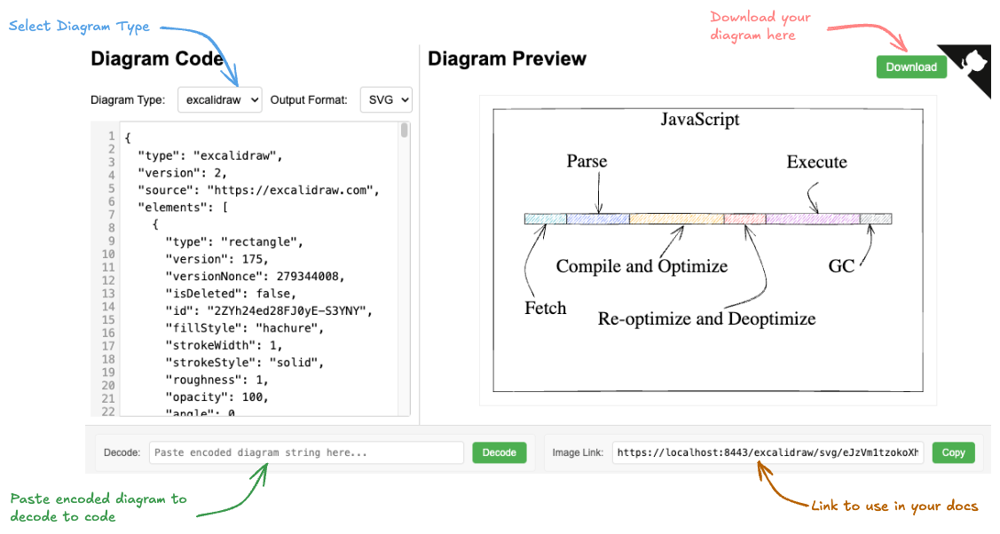

# DocCode — self-hostable diagram editor with optional AI assistant

DocCode is an open-source, self-hostable web diagram editor built on
[Kroki](https://kroki.io/): 50+ text-to-diagram formats (PlantUML, Mermaid,
GraphViz, D2, BPMN, Excalidraw, ...), a syntax-highlighted editor with live
preview, Draw.io visual editing, and an *optional* AI assistant that works with
your own API key (OpenRouter, LiteLLM, or any OpenAI-compatible endpoint) — or
fully bring-your-own-key from the browser. One `docker compose` stack, no
database, all user state stays in the browser.



<blockquote style="background:#f9f9f9; border-left: 6px solid #ccc; padding: 1em; font-size: 0.95em;">
  <strong>Note:</strong><br>
  While the initial framework and specifications were manually crafted, over <strong>90%</strong> of the code in this repository was generated using AI tools. As such, the code quality and structure may not fully reflect best practices and have not undergone extensive manual review.<br><br>
  That said, I have been actively <em>dogfooding</em> the tool, and it is functional and working as intended in real-world usage.
</blockquote>

<p align="center">
  
</p>

---

## Deployment modes

| Mode | When to use | TLS | AI relay | Rate limits |
|---|---|---|---|---|
| **Closed-network** (default) | Trusted LAN / team / CI | Self-signed | On with your key | Relaxed (no 429s for batch jobs) |
| **Production / public** | Internet-facing | Let's Encrypt (acme) | BYOK or token-gated relay | Strict (10 r/s, 1 MB body cap) |

The default `./setup-kroki-server.sh start` is the closed-network mode — safe for
trusted networks out of the box, not hardened for the public internet.

---

## Quick Start

```bash
# Clone and start
git clone https://github.com/vppillai/kroki-server.git
cd kroki-server
./setup-kroki-server.sh start

# Access DocCode at https://localhost:8443/
# Test health: ./setup-kroki-server.sh health
```

---

## What is DocCode?

DocCode is a feature-rich web frontend for [Kroki](https://kroki.io/) diagram
servers that transforms diagram creation from code into an intuitive, AI-powered
experience.

### Key Features

- **50+ Diagram Types**: PlantUML, Mermaid, GraphViz, BPMN, D2, Excalidraw, and more
- **AI-Powered Assistant**: Generate and modify diagrams using natural language
- **Professional Editor**: Syntax highlighting, auto-save, file operations, zoom/pan controls
- **Visual Editor**: WYSIWYG Draw.io integration for complex diagrams
- **Multiple Output Formats**: SVG, PNG, PDF, and more
- **Real-time Preview**: See changes instantly as you type
- **File Management**: Open, save, auto-reload with external editor support
- **Responsive Design**: Works seamlessly on desktop, tablet, and mobile

---

## Installation & Setup

### System Requirements

- Docker and Docker Compose >= 2.24.0
- Bash shell (Linux/macOS/WSL)

### Basic Setup

```bash
# 1. Clone the repository
git clone https://github.com/vppillai/kroki-server.git
cd kroki-server

# 2. Start all services
./setup-kroki-server.sh start

# 3. Access DocCode
# Open https://localhost:8443/ in your browser
# (Accept the self-signed certificate warning)
```

> **GoAT diagrams:** GoAT (ASCII-art → SVG) is supported, but it is not in any
> released Kroki image yet, so the `core` service uses a build from Kroki `main`
> (`ghcr.io/vppillai/kroki-core:goat`). `./setup-kroki-server.sh start` pulls that
> image automatically; publish it once via the **Build Kroki core (GoAT) image**
> GitHub Action, or build it locally with `./build-kroki-core.sh` if you have no
> registry access. All other diagram types use the standard released images.

### Custom Configuration

Edit the `.env` file (auto-created from `.env.example` on first run) to customize
ports and settings. See `.env.example` for all available options with comments.

After editing `.env`, restart the services:
```bash
./setup-kroki-server.sh restart
```

---

## Production / Public Deployment

The default `./setup-kroki-server.sh start` is tuned for **closed networks**: it
generates a self-signed certificate, enables the AI relay with the server's API key,
and applies no render rate limits. **Do not expose it to the internet as-is.**

For a public deployment, see:

- **[docs/production-deployment.md](docs/production-deployment.md)** — threat model,
  quick recipe, and reference for every knob: `TLS_MODE`, `DEPLOY_PROFILE`,
  `RENDER_CACHE_ENABLED`, `COMPOSE_PROFILES`, AI posture, `GUNICORN_*`, sizing
- **[docs/acme-tls.md](docs/acme-tls.md)** — real TLS via Let's Encrypt (staging-first
  procedure, renewal mechanics, rollback)
- **[docs/public-demo-hosting-runbook.md](docs/public-demo-hosting-runbook.md)** —
  Hetzner provisioning, DNS, OpenRouter relay setup, monitoring, abuse response

Key knobs at a glance:

| Knob | Closed-network default | Production / public |
|---|---|---|
| `TLS_MODE` | `selfsigned` | `acme` |
| `DEPLOY_PROFILE` | `private` | `public` |
| `RENDER_CACHE_ENABLED` | `true` | `true` |
| `COMPOSE_PROFILES` | `companions` | `` (trimmed) or `companions` |
| `AI_PROXY_API_KEY` | your key or empty | empty (byok) or token-gated relay |

---

## AI Assistant Setup

DocCode includes an AI assistant that can generate, modify, and explain diagrams
using natural language.

### AI deployment modes

The server advertises one of three AI postures depending on your `.env`:

| Mode | When | Behaviour |
|---|---|---|
| `relay` | `AI_ENABLED=true` + `AI_PROXY_API_KEY` set | Server proxies requests on its own key. |
| `byok` | `AI_ENABLED=true` + `AI_PROXY_API_KEY` empty | Relay unusable; the assistant UI guides users to bring their own OpenAI-compatible key. Requests go directly from the browser to the user's provider — the key never reaches this server. |
| `off` | `AI_ENABLED=false` | Assistant button hidden; true kill switch. |

The mode is computed at startup from exactly those two variables.

**Relay cost warning:** the relay spends `AI_PROXY_API_KEY` on every assistant
request. A single motivated user can trigger multi-dollar-per-hour costs against
an unprotected relay. Before exposing a relay-enabled instance beyond a trusted
network:
- Set `AI_MODEL_ALLOWLIST="*:free"` to pin free-tier models (e.g. on OpenRouter).
- Set `AI_DAILY_LIMIT_PER_IP` to cap per-user spend (e.g. `"10/minute;30/day"`).
- Set `AI_ACCESS_TOKEN` to require a shared bearer token for relay access.
- Or leave `AI_PROXY_API_KEY` empty to run in `byok` mode (zero relay cost).

See [docs/production-deployment.md](docs/production-deployment.md) for the full
AI cost management section.

**BYOK privacy guarantee:** in `byok` mode (or when users enable "Use Direct API"
in Settings), the API key is stored only in the browser (localStorage) and sent
only to the endpoint the user configures — never to the DocCode server. This is
structurally enforced in code and locked by regression tests. See
[docs/byok-privacy.md](docs/byok-privacy.md) for the full guarantee and DevTools
verification steps.

### Quick AI Setup (Recommended)

**Using OpenRouter** (supports 50+ models from multiple providers):

```bash
# 1. Get API key from https://openrouter.ai
# 2. Add to .env file:
AI_ENABLED=true
AI_PROXY_URL=https://openrouter.ai/api/v1
AI_PROXY_API_KEY=sk-or-v1-your-api-key-here
AI_PROXY_NAME="OpenRouter"
AI_MODEL=openai/gpt-4o-mini

# 3. Restart services
./setup-kroki-server.sh restart
```

### Dynamic Model Discovery

DocCode automatically fetches the list of available models from the configured LLM
proxy at server startup. This means the model dropdown always reflects what the
proxy actually supports — no manual model list maintenance required.

- On startup, the server queries the proxy's `/v1/models` endpoint
- Non-chat models (embeddings, TTS, etc.) are filtered out automatically
- Models are grouped by provider prefix in the settings dropdown
- If the proxy is unreachable, a static fallback list (`ai-models.json`) is used
- The admin script shows the model fetch status in **green** (success) or **red**
  (fallback) after `start`/`restart`
- If a previously selected model is no longer available, the frontend auto-switches
  to the server default

### Supported AI Providers

The available models depend on your proxy configuration. With **OpenRouter**, you
get access to:

- **OpenAI**: GPT-4o, GPT-4o Mini, and more
- **Anthropic**: Claude Opus, Sonnet, Haiku families
- **Google**: Gemini 2.5 Pro/Flash, Gemma models
- **Meta**: Llama 4, Llama 3.3 series
- **Mistral**: Mistral Medium, Codestral, Small/Nemo
- **Others**: Qwen, DeepSeek, plus many free-tier options

With **LiteLLM**, you can configure any combination of providers and the model list
will be discovered automatically.

### Alternative AI Setup Options

**LiteLLM (for multiple provider management):**
```bash
# Install and configure LiteLLM proxy
pip install litellm[proxy]
# Configure your providers in litellm_config.yaml
litellm --config litellm_config.yaml --port 4000

# Update DocCode configuration
AI_PROXY_URL=http://localhost:4000/v1
```

**Direct API (frontend configuration):**
Users can also configure AI credentials directly in the DocCode interface through
Settings → AI Assistant.

### AI Capabilities

- **Generate Diagrams**: "Create a sequence diagram for user authentication"
- **Modify Existing**: "Add error handling to this flowchart"
- **Format Conversion**: "Convert this PlantUML to Mermaid format"
- **Code Assistance**: "Fix the syntax errors in my diagram"
- **Explanations**: "Explain what this diagram represents"

---

## Deployment Footprint

DocCode ships two footprints controlled by `COMPOSE_PROFILES` in `.env`.

| Config | Containers | Idle RAM | Loaded RAM | Image disk |
|---|---|---|---|---|
| **Full set** (default) | core + mermaid + bpmn + excalidraw + diagramsnet + demosite + nginx | ~0.9–1.7 GB | 2.5–3.5 GB+ (uncapped) | ~10.2 GB |
| **Trimmed** | core + mermaid + demosite + nginx | ~0.4–0.8 GB | capped ~2.9 GB (sum of limits) | ~5.6 GB |

### Choosing a footprint

**Full set (default — no action needed for self-hosters):**
```
COMPOSE_PROFILES=companions   # bpmn + excalidraw + diagramsnet included
```

**Trimmed (core + mermaid only — saves ~4.7 GB image pulls and ~0.5–1 GB idle RAM):**
```
COMPOSE_PROFILES=             # empty = trimmed
DISABLED_DIAGRAM_TYPES=bpmn,excalidraw,diagramsnet   # hides them from the UI dropdown
# Uncomment the resource-limit block in .env to cap RAM on a 4 GB box
```

After editing `.env`, apply with `./setup-kroki-server.sh restart`.

> **Note for users bypassing the script:** if your `.env` predates the
> `COMPOSE_PROFILES` variable, running `docker compose up` directly will silently
> drop the three companion services. Add `COMPOSE_PROFILES=companions` to your
> `.env` to restore the full set. The setup script sets this default automatically.

> **Docker Compose version required:** >= 2.24.0 (for `--profile '*'` teardown and
> `deploy.resources.limits` support). Check with `docker compose version`.

---

## Using DocCode

### Basic Diagram Creation

1. **Select Diagram Type**: Choose from the dropdown (PlantUML, Mermaid, etc.)
2. **Write Code**: Use the syntax-highlighted editor
3. **See Results**: Preview updates automatically as you type
4. **Export**: Download as SVG, PNG, PDF, or copy links

### File Operations

- **New**: `Ctrl/Cmd + N` - Create new diagram
- **Open**: `Ctrl/Cmd + O` - Open existing files
- **Save**: `Ctrl/Cmd + S` - Save your work
- **Auto-reload**: Enable to sync with external editors

### AI Assistant Usage

1. **Open AI Chat**: Click the "AI Assistant" button
2. **Natural Language**: Type requests like "Create a database schema diagram"
3. **Iterate**: Ask for modifications: "Add a user authentication table"
4. **Apply Changes**: AI-generated code appears in your editor

### Visual Editor (Draw.io)

For complex diagrams, use the integrated Draw.io editor:

1. **Select Type**: Choose "diagramsnet" from dropdown
2. **Open Visual Editor**: Click "Visual Editor" button
3. **Edit Visually**: Use familiar Draw.io interface
4. **Sync Back**: Changes automatically update the code editor

---

## Management Commands

DocCode includes comprehensive management tools:

```bash
# Service Management
./setup-kroki-server.sh start     # Start all services
./setup-kroki-server.sh stop      # Stop all services
./setup-kroki-server.sh restart   # Restart services
./setup-kroki-server.sh status    # Check service status

# Monitoring & Debugging
./setup-kroki-server.sh health    # Health check all endpoints
./setup-kroki-server.sh logs      # View service logs

# Maintenance
./setup-kroki-server.sh clean     # Remove all containers and data

# Help
./setup-kroki-server.sh help      # Show all available commands
```

---

## Advanced Configuration

### Custom Hostname & SSL

```bash
# Custom hostname
./setup-kroki-server.sh start --hostname your-domain.com

# Custom SSL certificates
./setup-kroki-server.sh start --cert path/to/cert.crt --key path/to/key.key
```

### Production app server (gunicorn)

The DocCode container runs **gunicorn** (gthread worker,
`GUNICORN_WORKERS × GUNICORN_THREADS` concurrency) — not the Flask dev server.
For bare local development outside Docker, `python demoSite/server.py` still works
(single Werkzeug process), but must not be exposed publicly.

Tune the production app server via `.env`:

```bash
GUNICORN_WORKERS=2        # processes (default: 2)
GUNICORN_THREADS=8        # threads per worker (default: 8)
GUNICORN_GRACEFUL_TIMEOUT=30  # drain window on SIGTERM (seconds)
GUNICORN_LOG_LEVEL=info   # gunicorn log verbosity
```

See `demoSite/gunicorn.conf.py` for all tunable parameters and their rationale.

### Performance Tuning

Configure performance settings through the Settings panel:

- **Debounce Delay**: Adjust diagram update frequency (100-5000ms)
- **Auto-reload Monitoring**: File change detection interval (500-5000ms)
- **Diagram Caching**: Enable caching for faster loading
- **Memory Limits**: Automatic cleanup of conversation history

### Security Features

- **CORS Protection**: Automatic whitelist generation
- **Model Validation**: Prevents AI model injection attacks
- **Request Limits**: Configurable max for diagram content
- **API Key Security**: Local storage only, never sent to server logs
- **CSP Headers**: Content-Security-Policy active; all JS/CSS vendored locally

---

## Supported Diagram Types

DocCode supports all Kroki diagram formats:

| Category | Formats |
|----------|---------|
| **UML & Flowcharts** | PlantUML, Mermaid, Nomnoml |
| **Technical Diagrams** | GraphViz, D2, BPMN, C4 |
| **Data & Architecture** | DBML, ERD, Bytefield |
| **Creative & Visual** | Excalidraw, Ditaa, Svgbob |
| **Specialized** | WaveDrom, Vega/Vega-Lite, TikZ |
| **Integration** | Draw.io (diagramsnet) |

### Output Formats

- **Vector**: SVG (recommended), PDF
- **Raster**: PNG, JPEG
- **Data**: Base64, Text output
- **Sharing**: Direct image links, encoded URLs

---

## API Usage

DocCode provides both GET and POST API endpoints:

### GET Requests (Standard Kroki)
```bash
GET /plantuml/svg/encoded-content
```

### POST Requests (Raw Content)
```bash
curl -X POST "https://localhost:8443/plantuml/svg" \
  -H "Content-Type: text/plain" \
  -d "@startuml
Alice -> Bob: Hello
@enduml" \
  --insecure
```

---

## Troubleshooting

### Common Issues

1. **Certificate Warnings**: Accept self-signed certificate or provide trusted certs
2. **Port Conflicts**: Change `HTTPS_PORT` in `.env` file if 8443 is in use
3. **AI Not Working**: Check API key configuration and model availability. Run
   `./setup-kroki-server.sh restart` and look for the red/green model status message
4. **AI Model Errors**: If the admin script shows a red warning about model fetch
   failure, verify `AI_PROXY_URL` and `AI_PROXY_API_KEY` in `.env`
5. **Slow Performance**: Adjust debounce delays in Settings

### Debug Commands

```bash
# Check container status
docker compose ps

# View logs
docker compose logs demosite
docker compose logs core

# Network inspection
docker network ls
docker network inspect kroki-server_kroki_network
```

### Getting Help

- **Health Checks**: `./setup-kroki-server.sh health`
- **Service Status**: `./setup-kroki-server.sh status`
- **View Logs**: `./setup-kroki-server.sh logs`
- **Reset Everything**: `./setup-kroki-server.sh clean && ./setup-kroki-server.sh start`

---

## Architecture Overview

```
┌─────────────┐     ┌─────────────┐     ┌─────────────┐
│    Nginx    │────▶│    Core     │────▶│   Mermaid   │
│   (HTTPS)   │     │   Kroki     │     │  Renderer   │
└─────────────┘     └─────────────┘     └─────────────┘
       │                   │                   │
       ▼                   ▼                   ▼
┌─────────────┐     ┌─────────────┐     ┌─────────────┐
│   DocCode   │     │    BPMN     │     │ Excalidraw  │
│  Frontend   │     │  Renderer   │     │  Renderer   │
└─────────────┘     └─────────────┘     └─────────────┘
```

- **Nginx**: HTTPS proxy, static file serving, render cache, rate limiting
- **Core Kroki**: Diagram coordination and routing
- **Renderers**: Specialized containers for different diagram types
- **DocCode**: Python/Flask (gunicorn) backend + browser-side JS frontend with AI integration

---

## Contributing

See **[CONTRIBUTING.md](CONTRIBUTING.md)** for the full development guide.

Quick reference — the two test commands CI requires:

```bash
# Python server tests (install deps first)
cd demoSite && pip install -r requirements-dev.txt
python -m pytest tests/test_server.py -q

# JavaScript tests (Bun)
cd demoSite && bun test tests/
```

---

## License & Attribution

- **License**: MIT License — see [LICENSE.md](LICENSE.md)
- **Built on**: [Kroki](https://github.com/yuzutech/kroki) by Yuzutech
- **AI Integration**: Custom implementation with multi-provider support

---

**Quick Links**:
- [Kroki Documentation](https://kroki.io/)
- [Source Code](https://github.com/vppillai/kroki-server)
- [Production Deployment Guide](docs/production-deployment.md)
- [Health Check](https://localhost:8443/api/health) (after starting)
- [Settings](https://localhost:8443/) → Settings Panel

*Ready to create amazing diagrams? Start with `./setup-kroki-server.sh start` and open https://localhost:8443/*
