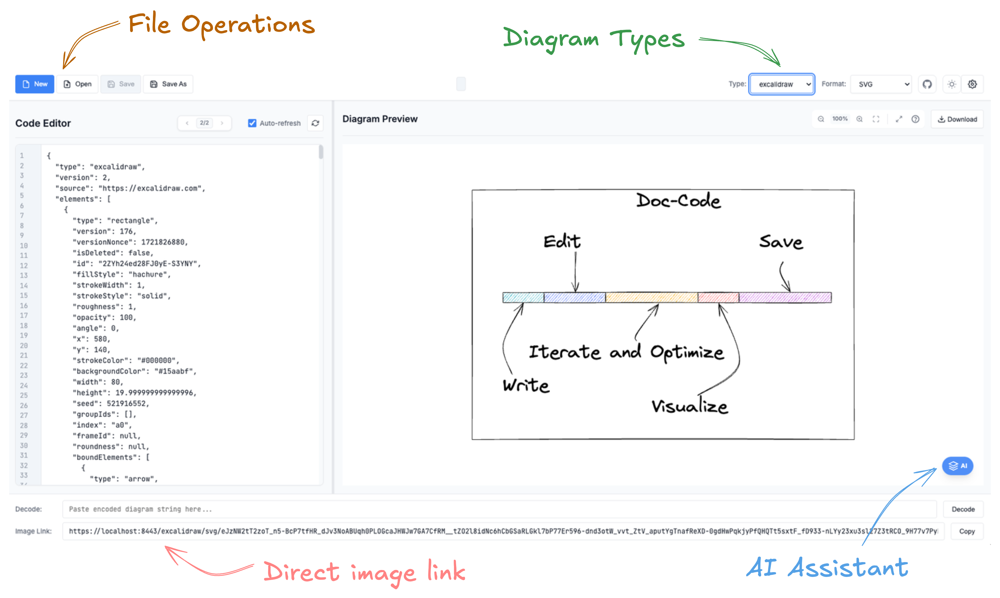

# DocCode - The Kroki Frontend

A comprehensive web-based diagram editor with AI assistance, built on top of the powerful Kroki diagram rendering server.



<blockquote style="background:#f9f9f9; border-left: 6px solid #ccc; padding: 1em; font-size: 0.95em;">
  <strong>Note:</strong><br>
  While the initial framework and specifications were manually crafted, over <strong>90%</strong> of the code in this repository was generated using AI tools. As such, the code quality and structure may not fully reflect best practices and have not undergone extensive manual review.<br><br>
  That said, I have been actively <em>dogfooding</em> the tool, and it is functional and working as intended in real-world usage.
</blockquote>

<p align="center">
  
</p>

## Quick Start

```bash
# Clone and start
git clone https://github.com/vppillai/kroki-server.git
cd kroki-server
./setup-kroki-server.sh start

# Access DocCode at https://localhost:8443/
# Test health: ./setup-kroki-server.sh health
```

## What is DocCode?

DocCode is a feature-rich web frontend for [Kroki](https://kroki.io/) diagram servers that transforms diagram creation from code into an intuitive, AI-powered experience.

### Key Features

- **50+ Diagram Types**: PlantUML, Mermaid, GraphViz, BPMN, D2, Excalidraw, and more
- **AI-Powered Assistant**: Generate and modify diagrams using natural language
- **Professional Editor**: Syntax highlighting, auto-save, file operations, zoom/pan controls
- **Visual Editor**: WYSIWYG Draw.io integration for complex diagrams
- **Multiple Output Formats**: SVG, PNG, PDF, and more
- **Real-time Preview**: See changes instantly as you type
- **File Management**: Open, save, auto-reload with external editor support
- **Responsive Design**: Works seamlessly on desktop, tablet, and mobile

## Installation & Setup

### System Requirements

- Docker and Docker Compose
- Bash shell (Linux/macOS/WSL)

### Basic Setup

```bash
# 1. Clone the repository
git clone https://github.com/vppillai/kroki-server.git
cd kroki-server

# 2. Start all services
./setup-kroki-server.sh start

# 3. Access DocCode
# Open https://localhost:8443/ in your browser
# (Accept the self-signed certificate warning)
```

### Custom Configuration

Edit the `.env` file to customize ports and settings:

```bash
# Server Configuration
HOSTNAME=localhost              # Server hostname
HTTP_PORT=8000                  # Kroki core server port
HTTPS_PORT=8443                 # Main HTTPS access port

# Application Information
VERSION=2.3.2
BUILD_DATE=2025-08-26
AUTHOR_NAME="Your Name"

# Visual Editor (Draw.io integration)
DRAWIO_SERVER_URL="https://embed.diagrams.net/embed"
```

After editing `.env`, restart the services:
```bash
./setup-kroki-server.sh restart
```

## AI Assistant Setup

DocCode includes a powerful AI assistant that can generate, modify, and explain diagrams using natural language.

### Quick AI Setup (Recommended)

**Using OpenRouter** (supports 50+ models from multiple providers):

```bash
# 1. Get API key from https://openrouter.ai
# 2. Add to .env file:
AI_ENABLED=true
AI_PROXY_URL=https://openrouter.ai/api/v1
AI_PROXY_API_KEY=sk-or-v1-your-api-key-here
AI_PROXY_NAME="OpenRouter"
AI_MODEL=openai/gpt-4o

# 3. Restart services
./setup-kroki-server.sh restart
```

### Dynamic Model Discovery

DocCode automatically fetches the list of available models from the configured LLM proxy at server startup. This means the model dropdown always reflects what the proxy actually supports — no manual model list maintenance required.

- On startup, the server queries the proxy's `/v1/models` endpoint
- Non-chat models (embeddings, TTS, etc.) are filtered out automatically
- Models are grouped by provider prefix in the settings dropdown
- If the proxy is unreachable, a static fallback list (`ai-models.json`) is used
- The admin script shows the model fetch status in **green** (success) or **red** (fallback) after `start`/`restart`
- If a previously selected model is no longer available, the frontend auto-switches to the server default

### Supported AI Providers

The available models depend on your proxy configuration. With **OpenRouter**, you get access to:

- **OpenAI**: GPT-5, GPT-4o, GPT-4o Mini, and more
- **Anthropic**: Claude Opus, Sonnet, Haiku families
- **Google**: Gemini 2.5 Pro/Flash, Gemma models
- **Meta**: Llama 4, Llama 3.3 series
- **Mistral**: Mistral Medium, Codestral, Small/Nemo
- **Others**: Qwen, DeepSeek, plus many free-tier options

With **LiteLLM**, you can configure any combination of providers and the model list will be discovered automatically.

### Alternative AI Setup Options

**LiteLLM (for multiple provider management):**
```bash
# Install and configure LiteLLM proxy
pip install litellm[proxy]
# Configure your providers in litellm_config.yaml
litellm --config litellm_config.yaml --port 4000

# Update DocCode configuration
AI_PROXY_URL=http://localhost:4000/v1
```

**Direct API (frontend configuration):**
Users can also configure AI credentials directly in the DocCode interface through Settings → AI Assistant.

### AI Capabilities

- **Generate Diagrams**: "Create a sequence diagram for user authentication"
- **Modify Existing**: "Add error handling to this flowchart"
- **Format Conversion**: "Convert this PlantUML to Mermaid format"
- **Code Assistance**: "Fix the syntax errors in my diagram"
- **Explanations**: "Explain what this diagram represents"

## Using DocCode

### Basic Diagram Creation

1. **Select Diagram Type**: Choose from the dropdown (PlantUML, Mermaid, etc.)
2. **Write Code**: Use the syntax-highlighted editor
3. **See Results**: Preview updates automatically as you type
4. **Export**: Download as SVG, PNG, PDF, or copy links

### File Operations

- **New**: `Ctrl/Cmd + N` - Create new diagram
- **Open**: `Ctrl/Cmd + O` - Open existing files
- **Save**: `Ctrl/Cmd + S` - Save your work
- **Auto-reload**: Enable to sync with external editors

### AI Assistant Usage

1. **Open AI Chat**: Click the "AI Assistant" button
2. **Natural Language**: Type requests like "Create a database schema diagram"
3. **Iterate**: Ask for modifications: "Add a user authentication table"
4. **Apply Changes**: AI-generated code appears in your editor

### Visual Editor (Draw.io)

For complex diagrams, use the integrated Draw.io editor:

1. **Select Type**: Choose "diagramsnet" from dropdown
2. **Open Visual Editor**: Click "Visual Editor" button
3. **Edit Visually**: Use familiar Draw.io interface
4. **Sync Back**: Changes automatically update the code editor

## Management Commands

DocCode includes comprehensive management tools:

```bash
# Service Management
./setup-kroki-server.sh start     # Start all services
./setup-kroki-server.sh stop      # Stop all services
./setup-kroki-server.sh restart   # Restart services
./setup-kroki-server.sh status    # Check service status

# Monitoring & Debugging
./setup-kroki-server.sh health    # Health check all endpoints
./setup-kroki-server.sh logs      # View service logs

# Maintenance
./setup-kroki-server.sh clean     # Remove all containers and data

# Help
./setup-kroki-server.sh help      # Show all available commands
```

## Advanced Configuration

### Custom Hostname & SSL

```bash
# Custom hostname
./setup-kroki-server.sh start --hostname your-domain.com

# Custom SSL certificates
./setup-kroki-server.sh start --cert path/to/cert.crt --key path/to/key.key
```

### Performance Tuning

Configure performance settings through the Settings panel:

- **Debounce Delay**: Adjust diagram update frequency (100-5000ms)
- **Auto-reload Monitoring**: File change detection interval (500-5000ms)
- **Diagram Caching**: Enable caching for faster loading
- **Memory Limits**: Automatic cleanup of conversation history

### Security Features

- **CORS Protection**: Automatic whitelist generation
- **Model Validation**: Prevents AI model injection attacks
- **Request Limits**: 10MB max for diagram content
- **API Key Security**: Local storage only, never sent to server logs

## Supported Diagram Types

DocCode supports all Kroki diagram formats:

| Category | Formats |
|----------|---------|
| **UML & Flowcharts** | PlantUML, Mermaid, Nomnoml |
| **Technical Diagrams** | GraphViz, D2, BPMN, C4 |
| **Data & Architecture** | DBML, ERD, Bytefield |
| **Creative & Visual** | Excalidraw, Ditaa, Svgbob |
| **Specialized** | WaveDrom, Vega/Vega-Lite, TikZ |
| **Integration** | Draw.io (diagramsnet) |

### Output Formats

- **Vector**: SVG (recommended), PDF
- **Raster**: PNG, JPEG
- **Data**: Base64, Text output
- **Sharing**: Direct image links, encoded URLs

## API Usage

DocCode provides both GET and POST API endpoints:

### GET Requests (Standard Kroki)
```bash
GET /plantuml/svg/encoded-content
```

### POST Requests (Raw Content)
```bash
curl -X POST "https://localhost:8443/plantuml/svg" \
  -H "Content-Type: text/plain" \
  -d "@startuml
Alice -> Bob: Hello
@enduml" \
  --insecure
```

## Troubleshooting

### Common Issues

1. **Certificate Warnings**: Accept self-signed certificate or provide trusted certs
2. **Port Conflicts**: Change `HTTPS_PORT` in `.env` file if 8443 is in use
3. **AI Not Working**: Check API key configuration and model availability. Run `./setup-kroki-server.sh restart` and look for the red/green model status message
4. **AI Model Errors**: If the admin script shows a red warning about model fetch failure, verify `AI_PROXY_URL` and `AI_PROXY_API_KEY` in `.env`
5. **Slow Performance**: Adjust debounce delays in Settings

### Debug Commands

```bash
# Check container status
docker-compose ps

# View logs
docker-compose logs demosite
docker-compose logs core

# Network inspection
docker network ls
docker network inspect kroki-server_kroki_network
```

### Getting Help

- **Health Checks**: `./setup-kroki-server.sh health`
- **Service Status**: `./setup-kroki-server.sh status`
- **View Logs**: `./setup-kroki-server.sh logs`
- **Reset Everything**: `./setup-kroki-server.sh clean && ./setup-kroki-server.sh start`

## Architecture Overview

```
┌─────────────┐     ┌─────────────┐     ┌─────────────┐
│    Nginx    │────▶│    Core     │────▶│   Mermaid   │
│   (HTTPS)   │     │   Kroki     │     │  Renderer   │
└─────────────┘     └─────────────┘     └─────────────┘
       │                   │                   │
       ▼                   ▼                   ▼
┌─────────────┐     ┌─────────────┐     ┌─────────────┐
│   DocCode   │     │    BPMN     │     │ Excalidraw │
│  Frontend   │     │  Renderer   │     │  Renderer   │
└─────────────┘     └─────────────┘     └─────────────┘
```

- **Nginx**: HTTPS proxy and static file serving
- **Core Kroki**: Diagram coordination and routing
- **Renderers**: Specialized containers for different diagram types
- **DocCode**: React-like frontend with AI integration

## Future Enhancements

The current architecture supports upcoming advanced features:

- **Enhanced Conversational AI**: Context-aware conversations with memory
- **Advanced Diagram Intelligence**: Smart analysis and explanation generation
- **Workflow Integration**: Documentation generation and version control
- **Collaboration Features**: Real-time sharing and editing
- **Voice Integration**: Voice-to-diagram conversion
- **Visual Context Processing**: Image-to-diagram analysis

## Contributing

Contributions are welcome! Please feel free to submit issues or pull requests.

### Development Setup

```bash
# Clone and setup development environment
git clone https://github.com/vppillai/kroki-server.git
cd kroki-server

# Start in development mode
./setup-kroki-server.sh start

# Make changes to demoSite/ files
# Restart to apply changes
./setup-kroki-server.sh restart
```

## License & Attribution

- **License**: MIT License
- **Built on**: [Kroki](https://github.com/yuzutech/kroki) by Yuzutech
- **AI Integration**: Custom implementation with multi-provider support

---

**Quick Links**:
- [📖 Kroki Documentation](https://kroki.io/)
- [💻 Source Code](https://github.com/vppillai/kroki-server)
- [🔍 Health Check](https://localhost:8443/api/health) (after starting)
- [⚙️ Settings](https://localhost:8443/) → Settings Panel

*Ready to create amazing diagrams? Start with `./setup-kroki-server.sh start` and open https://localhost:8443/*